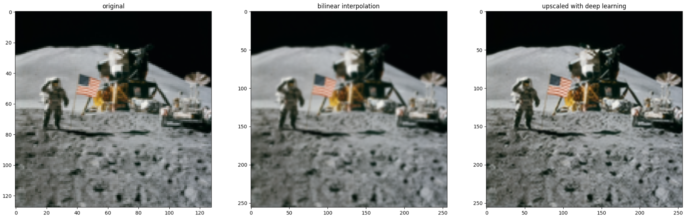
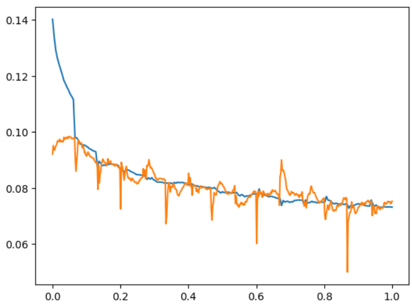
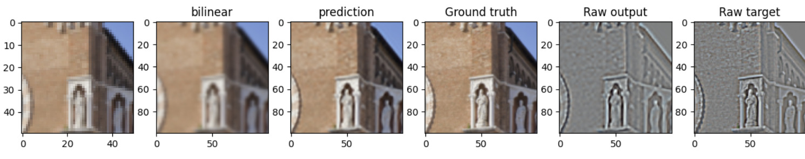
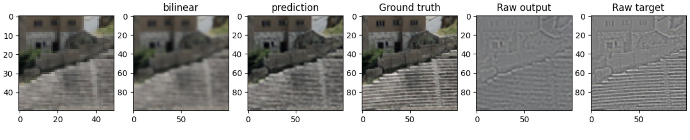

# DIY AI image superresolution

This is a student project I took up after hearing the introduction to deep learning lecture (I2DL) at Technical University of Munich (TUM). My goal for this project was to improve my pytorch skills and undertake my first self-directed deep learning project.

The interesting parts of the project are in the `upscale_resnet.ipynb` and `upscale_unet.ipynb`. The unet upscaler implements a unet as feature extractor. The resnet backbone upscaler uses an architecture similar to a unet, but the encoder blocks are blocks from a pretrained resnet.

## Inspiration
This project does not aim for cutting-edge performance, but learning. I did not try to implement a fancy new architecture, but instead implemented some well-proven ideas from papers from around 2015, mostly:
1. [Learning a Deep Convolutional Network for Image Super-Resolution](https://citeseerx.ist.psu.edu/document?repid=rep1&type=pdf&doi=77546b6c251846c6dfa2e4ac29d8fc0407f8f904)(2014): Use of convolutional neural networks, learning the difference from a bilinear interpolation to the high resolution image instead of the whole upscaling function.
2. [Deep Residual Learning for Image Recognition](https://openaccess.thecvf.com/content_cvpr_2016/papers/He_Deep_Residual_Learning_CVPR_2016_paper.pdf)(2015) The key innovation of this paper, the resnet gradient highway, was used extensively. For an encoder, a pretrained ResNet like presented in the paper was used, and the decoder blocks as well as the upscaler are composed of ResNet blocks.
3. [U-Net: Convolutional Networks for Biomedical Image Segmentation](https://arxiv.org/abs/1505.04597)(2015) The feature extractor architecture from this paper was used in both architectures presented.
4. [Perceptual Losses for Real-Time Style Transfer and Super-Resolution](https://arxiv.org/abs/1603.08155)(2016) Perceptual loss function based on a pretrained classifier was implemented following the suggestion from this paper. 

## Takeaways

### Training data

For training, a self-compiled dataset based on the Wikimedia Commons valued images category was used. The download lists are available in `data/valued`. The bulk of the dataset are photographs, mostly of plants, animals and architecture. The coverage of other subject categories is rather poor. For augmentation, crops are taken of the images. Surprisingly this results in a easier data set because many crops show just sky or parts of the image without fine details. Still the augmentation is essential to the resulting networks ability to upscale detail at any given scale, not just the scale present in the unaugmented training data.

### Training procedure

Using a large batch size was essential to getting stable gradients, smaller batch sizes would frequently result in overfitting to one image and training breaking down immediately afterwards. Using a perceptual loss as proposed by [Johnson](https://arxiv.org/abs/1603.08155) brought an enormous improvement in the believability of the resulting images. The first loss function used was a simple L2 loss comparing the output of the network to the difference betweeen bilinear upscaling and the high resolution image. This loss function completely failed at reproducing sharp edges.

To correctly reconstruct sharp edges, the switch was made to an L1 loss function that favors sparser errors over low average error. Still the results were not believable as high-quality photographs because the network only reconstructed edges, but not high frequency textures, because it is "smarter" for the network to not produce high-frequency textures (resulting in a medium loss) than to draw correct detail offset by just a pixel (resulting in very high loss). The perceptual loss instead compares how a pretrained image classifier responds to the upscaled image and the high-resolution target, then backpropagates an L1 loss on the classifier output.

Another problem related to the loss is the possibility of overfitting to not producing any detail at all. This was a huge problem for all my earlier architectures: Learning would always plateau at producing no detail, despite very high learning rates and overfitting to a single image. Using a pretrained encoder (based on blocks from ResNet18 trained on ImageNet classification) solved that problem.

### The evolution of the architecture
I first started with a UNet for feature extraction and a transpose convolution layer for upscaling. This approach had issues with learning useful features because it would at first overfit to no detail output. Using pretrained encoders for feature extraction solved that problem. The final network architecture is similar to a UNet, but the encoders are pretrained and are not further trained so that they do not require gradients to enable a larger batch size. The final architecture is meant to operate on the bilinear upscaling of an image, so no transpose convolution, which also was identified in the literature as a cause for performance issues, is needed anymore. The upscaler itself is a ResNet to enable gradient propagation to the decoder blocks, which also consist of a ResNet block to ensure the whole network can properly learn.

Using the right loss function was extremely important for getting results that are both sharp and have accurate high frequency texture. A perceptual loss based on pretrained ResNet18 was utilized. Two losses are calculated, one with 3 layers and one with 6 layers. The loss after three layers encourages proper sharp edges which the 6 layer loss does not reproduce accurately, but does not help with texture as much as the 6 layer loss. A L1 loss term on the output image with a small weight was added because the pretrained classifiers are rather insensitive to shifts in hue and brightness of the image, without the loss on the output image, using only the perceptual losses results in shifted colors and wrong brightness levels.

Notable is the rather small size of the network with only about a million trainable parameters.

### Possible improvements
Additional losses could be introduced to encourage sharper results.

Sometimes even the rather small network starts hallucinating, in this example the staircase detail goes in the wrong direction.

Further augmentations of the dataset could be added to also perform image enhancements, i.e. noise and artifact removal.

Through a GAN training setup, possibly much better upscaling performance and a more powerful network could be realized.